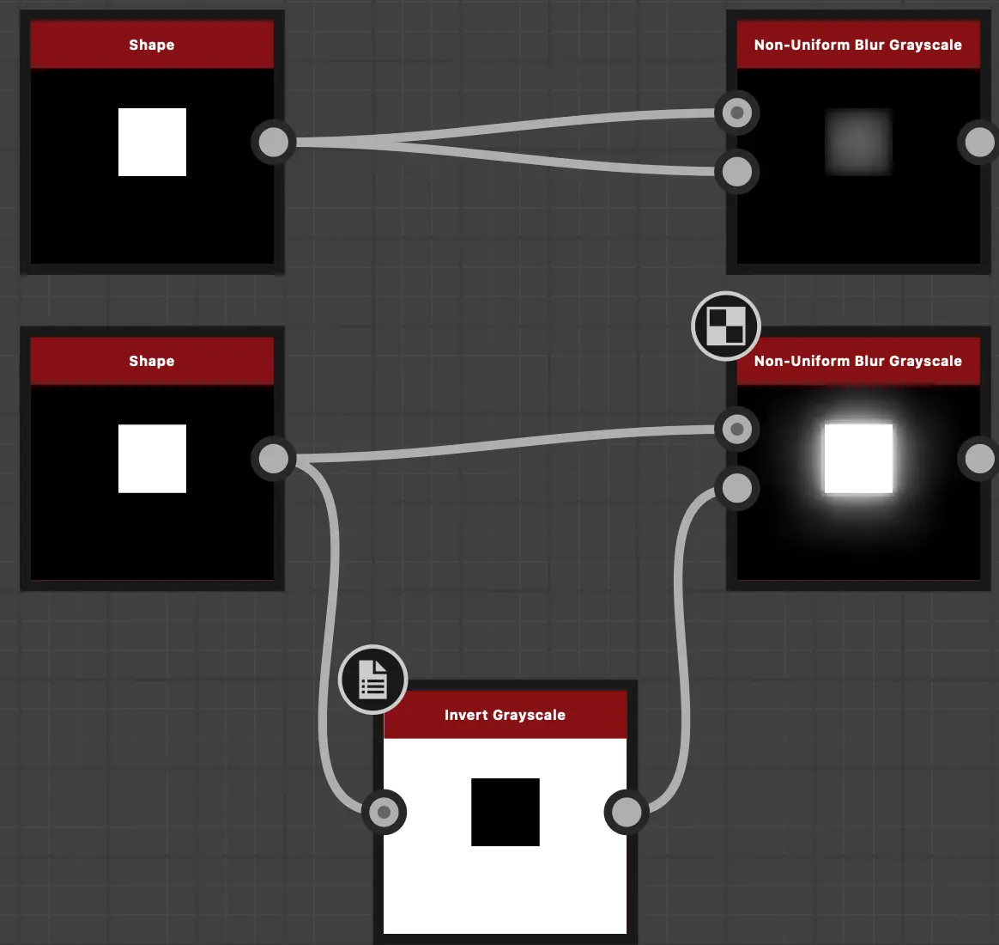
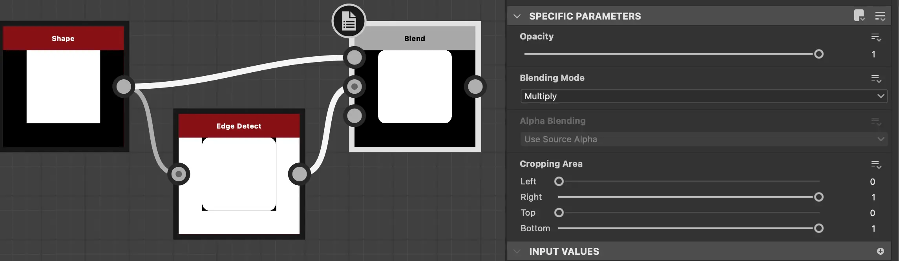
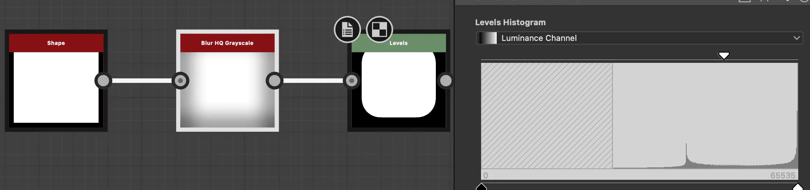
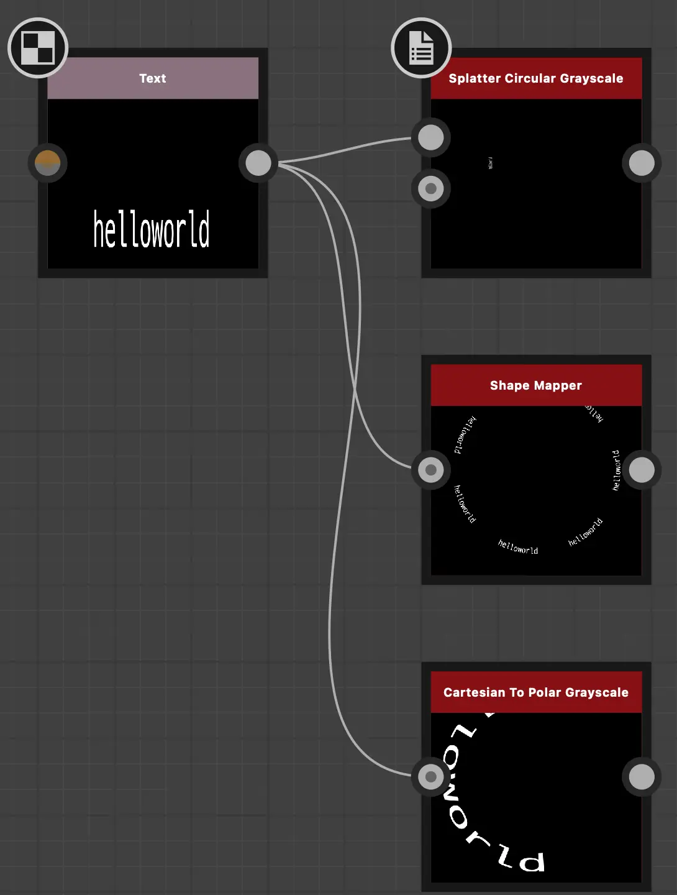

non-uniform-blur

edge detect로 크기가 맞게 편하게 작업할 수 있음. 다만 round됨에 있어 한계가 있음.

blur와 level로 round성을 좀 더 조절 할 수 있음. 크기 조절 귀찮음.

마법진할때 Splatter Circular로 만드는게 좋을듯.

## 높이맵

- height 블랜드시
 - level로 미리 조정하는데 다음과 같이 커스텀 Level노드를 만들어 주면 좋다.
   - Level Out Low : lerp(0.5, 0, _Opacity)
   - Level Out High : lerp(0.5, 0, _Opacity)

blend 노드 div는 원본과 Diff보기 용으로 사용.

크랙선에 Multi Dir. Warp Grayscale + Noise로 노이즈를 2번정도 먹히고 Histogram Select 그리고 Blur HQ Grayscale후 Threshold로 마스킹 영역

- Gradient
  - 이미지 다운로드 받고 블러를 걸고
    - Gradient Map 으로 긁어주기
    - 혹은, Gradient(Dynamic)에 쓰기

==========

Blend
Tile Sampler
Flood Fill

Cell2/4

BnW Spots 흙